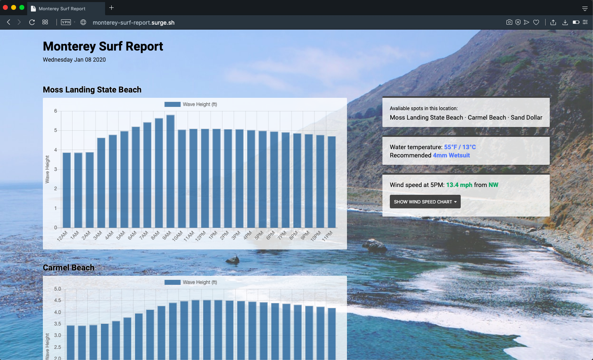

# Monterey surf report

## Need to find a new API for fetching data - Spitcast API does not work now.

Surf forecast app written using pure JS that provides the information about surf conditions on the most popular spots in [Monterey county](https://en.wikipedia.org/wiki/Monterey_County,_California).

This project uses the [Spitcast API](http://www.spitcast.com/api/docs/) to fetch data and [Chart.js](https://www.chartjs.org/) to represent this data.

## Getting started

You can use [live version](http://monterey-surf-report.surge.sh) or clone the repository and run:

    npm install
    npm run dev-server

This will start devserver and will launch the app in the development mode.

Open [http://127.0.0.1:8080/](http://127.0.0.1:8080/) to view it in the browser.

## Contributing

Please feel free if you want to contribute, pull requests are always welcome ❤️
